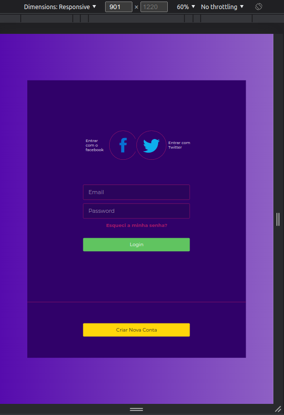

# responsiveLoginForm

Responsive Login Form using HTML || SCSS || NIXINS || SCSS VARIABLES || MEDIA QUERY (Formulário de login responsivo usando HTML || SCSS || NIXINS || VARIÁVEIS SCSS || MEDIA QUERY)

---

---

Reproduzido do canal de 🇮🇳 Kishan Sheth - youtube.com
